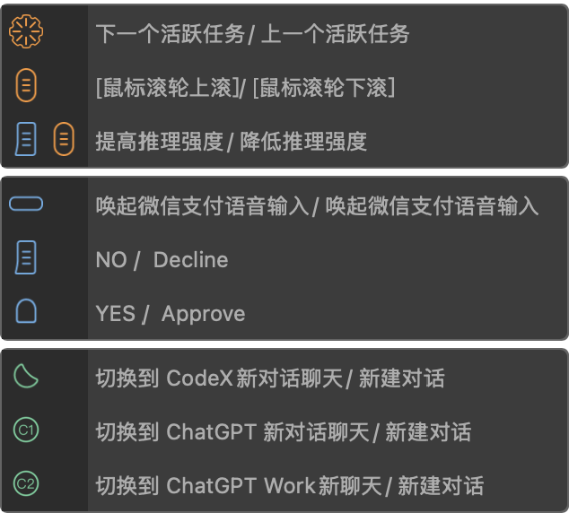

# ChatGPT / Codex · 1.0.0

- 文件：[`ChatGPT_Codex.tb`](ChatGPT_Codex.tb)
- 日期：2026-08-07
- 官方分享：[TourBox Preset](https://www.tourboxtech.com/oap/presets/?presetShareId=1282502239801446400)
- 状态：已通过 TourBox 官方审核

## 主要映射

| 按键 | 功能 |
| --- | --- |
| Knob | 下一个 / 上一个活跃任务 |
| Scroll | 鼠标滚轮上 / 下 |
| Side + Scroll | 提高 / 降低推理强度 |
| Top（左上横键） | 微信输入法语音输入（建议全局） |
| Tall | NO / Decline |
| Short | YES / Approve |
| Tour | 切换到 Codex 新对话 |
| C1 | 切换到 ChatGPT 新对话 |
| C2 | 切换到 ChatGPT Work 新聊天 |

另含：切换模型、新建对话、活跃 Agent 切换、切换活动任务等（见 Console Guide / HUD）。

## 重点建议

把 **Top（左上横键）** 设为**全局微信输入法语音**，任意窗口都能口述落字，再交给 Codex；不必依赖仅在 ChatGPT 内生效的内置语音。

## 键位截图

